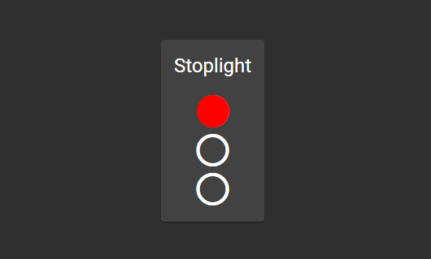

# StoplightApp

A simple app that displays an infinitely looping stoplight. Angular Material and Bootstrap were used for quick prototyping.

Most of the functionality lives [here](src\app\components\stoplight\stoplight.component.ts).

## Running Locally

Run `npm install` to fetch and install all dependencies.

Run `ng serve` for a dev server. Navigate to `http://localhost:4200/`. The app will automatically reload if you change any of the source files.

## Running unit tests

Run `ng test` to execute the unit tests via [Karma](https://karma-runner.github.io).
